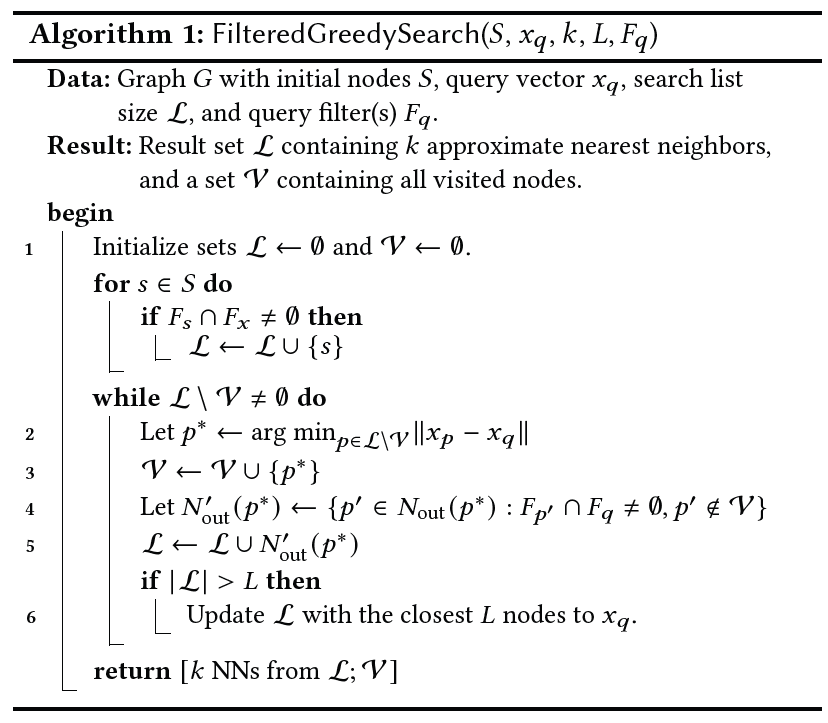
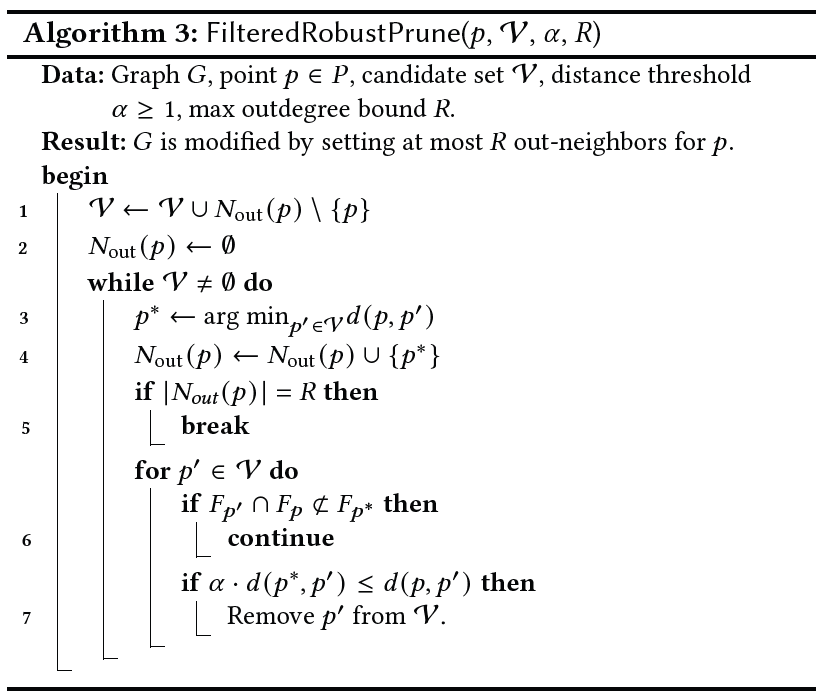
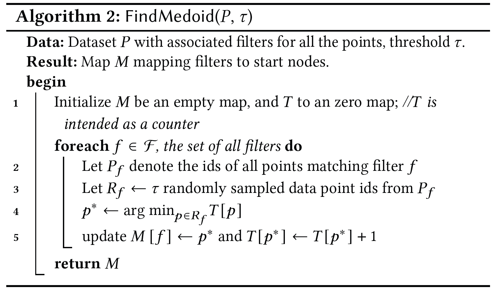
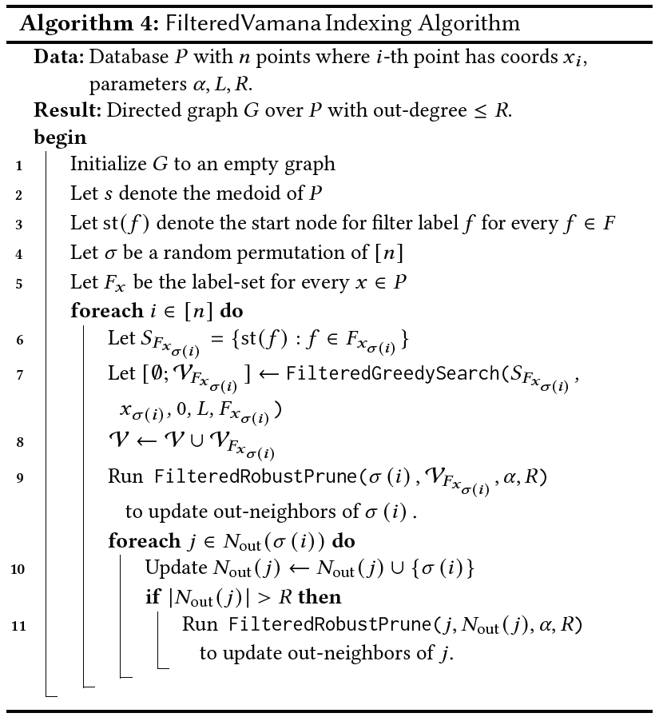
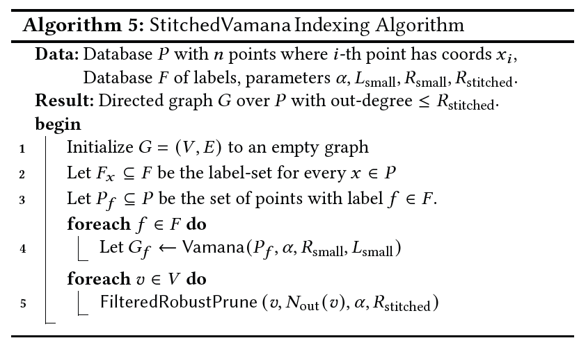

<h1 align="center">Ανάπτυξη Λογισμικού για Πληροφοριακά Συστήματα</h1>

<div align="center">


	
</div>


##  Project: Προσσεγιστική Επίλυση του προβλήματος K-Εγγύτερων Γειτόνων (K-Nearest Neigbours) μέσω του Αλγορίθμου **Vamana Indexing Algorithm (VIA)**
### Τμήμα Πληροφορικής και Τηλεπικοινωνιών - ΕΚΠΑ (DIT - UOA) - Χειμερινό Εξάμηνο 2024-2025


<div align="center">

| Ονοματεπώνυμο    | Αριθμός Μητρώου  |        email         |
| :-------------:  | :-------------:  |   :-------------:    |
| Ζήκας Αντώνιος   | 1115202100038    | sdi2100038@di.uoa.gr |
| Χασιώτη Ευανθία  | 1115202100289    | sdi2100289@di.uoa.gr |
| Κώτσιλας Σταύρος | 1115201700292    | sdi1700292@di.uoa.gr |

</div>


## Overview👀

### Χαρακτηριστικά Κώδικα⚙️
- <ins>Γλώσσα Υλοποίησης:</ins> C++11
- <ins>Μεταγλώττιση:</ins> **g++** (έγινε modularization των αρχείων σε directories και χρήση του [make](https://www.gnu.org/software/make/manual/make.html))
- <ins>Επαλήθευση Ορθότητας Κώδικα:</ins> **Unit Tests** με την χρήση της βιβλιοθήκης [Acutest](https://github.com/mity/acutest) (η εκτέλεση των test γίνεται μέσω ένος makefile rule)
- <ins>Mέσω της χρήσης [Github Actions](https://github.com/features/actions)</ins> εξασφαλίσαμε σε κάθε στάδιο ανάπτυξης του δεύτερου μέρους του Project την ορθή λειτουργία του κώδικα που γινόταν pushed στο main branch.

### Μεταγλώττιση και Εκτέλεση⚒️⚡
- **Μεταγλώττιση του Κώδικα🛠️** 
  
  Για την κατασκευή των εκτελέσιμων αρχείων παρέχονται διάφορες εντολές που εξασφαλίζουν τη μεταγλώττιση της κύριας εφαρμογής, των unit tests, καθώς και συνδιασμό τους:
  - Για την μεταγλώττιση της κύριας εφαρμογής:
    ```bash
    make app
    ```
  - Για την μεταγλώττιση των unit tests
    ```bash
    make tests
    ```
  - Για την μεταγλώττιση και των δύο:
    ```bash
    make all
    ```
- **Εκτέλεση των Unit Tests🧪**

  Για την εκτέλεση των **unit tests** παρέχονται δύο **makefile rulew** με τα οποία εκτελούνται όλα τα unit tests, απλά, είτε με τη χρήση του [valgrind](https://en.wikipedia.org/wiki/Valgrind) για έλεγχο της κατάστασης της μνήμης. Οι αντίστοιχες εντολές είναι:
  - Απλή Εκτέλεση:
    ```bash
    make run_tests
    ```
  - Εκτέλεση με Valgrind:
    ```bash
    make run_tests_valgrind
    ```
- **Εκτέλεση Εφαρμογής▶️**

  Η εφαρμογή στηρίζεται πάνω σε **ένα εκτελέσιμο αρχείο** το οποίο αφού μεταγλωττίσετε τον κώδικα μπορείτε να το βρείτε στο `/bin/main`. Αυτό το εκτελέσιμο αρχείο είναι υπεύθυνο για την εκτέλεση όλων των αλγορίθμων, χρησιμοποιώντας κατάλληλα **command line arguments** τα οποία περιγράφονται παρακάτω. Μερικά ενδεικτικά παραδείγματα όλων των λειτουργιών που προφέρει η εφαρμογή έχουν συμπιεστεί σε κατάλληλα makefile rules τα οποία είναι:
  - **Δημιουργία Simple Vamana:**
    ```bash
    make create_simple_via
    ``` 
  - **Δημιουργία Filtered Vamana:**
    ```bash
    make create_filtered_via
    ``` 
  - **Δημιουργία Stiched Vamana:**
    ```bash
    make create_stiched_via
    ``` 
  καθώς επίσης και δοκιμές πάνω σε **αποθηκευμένα indexes:**
  - **Δοκιμή Simple Vamana:**
    ```bash
    make test_simple_via
    ``` 
  - **Δοκιμή Filtered Vamana:**
    ```bash
    make test_filtered_via
    ``` 
  - **Δοκιμή Stiched Vamana:**
    ```bash
    make test_stiched_via
    ```

> [!IMPORTANT]
> Για το δεύτερο μέρος της εργασίας χρειάστηκε να υλοποιήσουμε εμείς έναν αλγόριθμο ο οποίος υπολογίζει το **Groundtruth** των δεδομένων. Γι' αυτό το λόγο παρέχεται και ένα επιπλέον makefile rule το οποίο φαίνεται παρακάτω και η δουλειά του είναι ακριβώς να υπολογίζει το Groundtruth για τα **Filtered** και **Stiched** indexes.
> ```bash
> make compute_groundtruth
> ```

- **Καθαρισμός αρχείων🧹**

	Για τον καθαρισμό των αντικειμενικών **(object files)** και των εκτελέσιμων αρχείων **(executable files)** χρησιμοποιείται η εντολή:
	```bash
	make clean
	```

### Datasets 🗂️

<center>
<b>VIA = Vamana Indexing Algorithm</b>
</center>

- **Πρώτο Μέρος (Simple VIA):**

	Τα [δεδομένα](http://corpus-texmex.irisa.fr/) που χρησιμοποιούνται για τον Αλγόριθμο **VΙΑ** του πρώτου μέρους, είναι ένα σετ διανυσμάτων **128** διαστάσεων (με αριθμούς κινητής υποδιαστολής (float)). Στον κώδικά μας αξιοποιήσαμε το σετ δεδομένων `ANN_SIFT10K`. το οποίο περιέχει:
	
	<div align="center">

	| Όνομα Αρχείου | Πλήθος στοιχείων | Διάσταση στοιχείων |
	| :---: | :---: | :---: |
	| `shiftsmall_base.fvecs` | 10.000 | 128 |
	| `shiftsmall_query.fvecs` | 100 | 128 |
	| `shiftsmall_groundtruth.ivecs` | 100 | 100 |

	</div>

	όπου:

	- `shiftsmall_base.fvecs`: **10.000** _base vectors_ διάστασης **128**. Κάθε vector θα αντιστοιχεί σε ένα κόμβο του γράφου **Vamana**, και περιέχει 128 floats.
	- `shiftsmall_query.fvecs`: **100** _query vectors_ διάστασης **128** τα οποία αναπαριστούν τα **"search" vectors** μας. O VIA θα υπολογίσει τους πλησιέστερους γείτονες αυτών των vectors.
	- `shiftsmall_groundtruth.ivecs`: Αυτό το αρχείο, για κάθε query vector, περιέχει **100** ακέραιες τιμές που αντιπροσωπεύουν τους **identifiers** (start 0) των _base vectors_ που είναι οι εγγύτεροι γείτονές τους.

- **Δεύτερο Μέρος (Filtered & Stiched VIA):**

	Στο δεύτερο μέρος του project χρησιμοποιήσαμε [δεδομένα](https://transactional.blog/sigmod-contest/2024) με **φίλτρα** τα οποία απαιτούν μία επιπλέον λειτουργικότητα στη διαδικασία κατασκευής του **VIA**. Συγκεκριμένα στην υλοποίησή μας χρησιμοποιήσαμε το [Dummy Dataset](https://github.com/transactionalblog/sigmod-contest-2024) το οποίο παρέχει:

	<div align="center">

	| Όνομα Αρχείου | Πλήθος στοιχείων | Διάσταση στοιχείων | Επιπλέον Παράμετροι |
	| :---: | :---: | :---: | :---: |
	| `dummy-data.bin` | 10.000 | 100 | 2 |
	| `dummy-queries.bin` | 1000 | 100 | 4 |

	</div>

	όπου:

	- `dummy-data.bin`: **10.000** _base vectors_ διάστασης **100**. Κάθε vector αντιστοιχεί σε ένα κόμβο του γράφου **Filtered Vamana**, και περιέχει **100** floating values και **2** επιπλέον παράμετροι που υποδεικνύουν τα **φίλτρα** του εκάστοτε vector. Κάθε _base vector_ έχει ένα συγκεκριμένο φίλτρο το οποίο καθορίζεται από τις αυτές τις δύο παραμέτρους. Συγκεκριμένα οι 2 επιπλέον παράμετροι είναι:
		- **C** (Categorical Attribute) και
		- **T** (Timestamp Attribute)
	- `dummy-queries.bin`: **1000** _query vectors_ με **100** floating values και **4** επιπλέον παραμέτρους που επεξηγούν τι είδους _query vector_ είναι και τι φίλτρα περιέχουν. Συγκεκριμένα οι επιπλέον παράμετροι είναι:
		- **Query Type**: Υποδεικνύει το είδος του _query vector_ και παίρνει τιμές $\{0, 1, 2, 3\}$.
		- **v** (Categorical Query Attribute): Σχετίζεται άμεσα με το **C** των _base vectors_ και παίρνει ακέραιες τιμές.
		- **l** (Left Timestamp Query Attribute): Σχετίζεται άμεσα με το **T** των _base vectors_ και παίρνει πραγματικές τιμές.
		- **r** (Right Timestamp Query Attribute): Σχετίζεται άμεσα με το **T** των _base vectors_ και παίρνει πραγματικές τιμές.

		 Κάθε _query vector_ αναπαριστά ένα **"search" vector**. Οι αλγόριθμοι **Filtered VIA** και **Stiched VIA** υπολογίζουν τους πλησιέστερους γείτονες αυτών των vectors.

> [!IMPORTANT]
> Στη συγκεκριμένη υλοποίηση των **Filtered VIA** και **Stiched VIA** δεν έχουμε λάβει υπόψη το **T** που είναι το timestamp attribute των _base vectors_.

### Περιγραφή Project και Ζητούμενα 📃📝
Σε αυτό το Project κληθήκαμε να υλοποιήσουμε τον Αλγόριθμο **Vamana Indexing**, o oποίος λειτουργεί ως μία Προσεγγιστική Λύση του Προβλήματος της Εύρεσης των Κ-Εγγύτερων Γειτόνων, μέσω της χρήσης κατευθυνόμενου γράφου για την αναπαράσταση και επεξεργασία των δεδομένων, τόσο για **filtered** όσο και για **unfiltered** δεδομένα. Η υλοποίησή μας στηρίχθηκε πάνω στα άρθρα:
- [DiskANN:Fast Accurate Billion-point Nearest Neighbour Search on a Single Node Search](https://proceedings.neurips.cc/paper_files/paper/2019/file/09853c7fb1d3f8ee67a61b6bf4a7f8e6-Paper.pdf) (2019)
- [Filtered − DiskANN: Graph Algorithms for Approximate Nearest Neighbor Search with Filters](https://harsha-simhadri.org/pubs/Filtered-DiskANN23.pdf) (2023)

Πιο συγκεκριμένα, μας ζητήθηκε να υλοποιήσουμε τους εξής αλγορίθμους:

- **Πρώτο Μέρος**:
	- VamanaIndex()
	- GreedySearch()
	- RobustPrune()
	- FindMedoid()
	- RecallEvaluation()
- **Δεύτερο Μέρος**:
	- FilteredVamanaIndex()
	- StichedVamanaIndex()
	- FilteredGreedySearch()
	- FilteredRobustPrune()
	- FilteredFindMedoids()

> [!NOTE]
> Για την εξέταση της λειτουργικότητας του **VIA** ήταν αναγκαίο να δημιουργήσουμε συμπληρωματικές κλάσεις και μεθόδους για:
> - Ανάγνωση και αποθήκευση των [δεδομένων](http://corpus-texmex.irisa.fr/) (με συμπληρωματικές μεθόδους για ανάκτηση δεδομένων).
> - Την δημιουργία κόμβων και την δημιουργία γράφου (και τις συμπληρωματικές τους μεθόδους).
> - Υπολογισμός ευκλείδειας απόστασης και απόστασης Manhattan μεταξύ διανυσμάτων n-διαστάσεων.

### Διαδικασία Ανάπτυξης, Συνεργασία και Αρμοδιότητες Συμμετεχόντων της Ομάδας 👥🤝
Στην Ανάπτυξη του Project αξιοποιήθηκε το εργαλείο **Issues** του github για την επικοινωνία και τον συγχρονισμό των διεργασιών που είχε αναλάβει να διεκπεραιώσει το κάθε μέλος της ομάδας.

Καθ' όλη την διάρκεια της ανάπτυξης του Project υπήρξε συνεχείς επικοινωνία των μελών τόσο μέσω των εργαλείων του github όσο και με προγραμματισμένα online calls.

- <ins>Ζήκας Αντώνιος (1115202100038)</ins>
  - **Υλοποίηση** της βασικής κλάσης `VectorData` και των μεθόδων της, για την αποθήκευση των δεδομένων των διανυσμάτων που διαβάζουμε από τα αρχεία `.fvecs` και `.bin`.
  - **Υλοποίηση** των κλάσεων και των μεθόδων `graph_node` και `graph`. Δομές πάνω στις οποίες στηρίζεται ο αλγόριθμος για την δημιουργία των **Vamana Indexes**.
  - **Υλοποίηση** και **βελτιστοποίηση** της συνάρτησης `CreateVamanaIndex()`.
  - **Συμβολή** στην **αποσφαλμάτωση** και **βελτιστοποίηση** του αλγορίθμου `GreedySearch()`.
  - **Υλοποίηση** συνάρτησης `ReadGroundtruth()`, για την ανάγνωση των ακέραιων δεδομένων του αρχείου `shiftsmall_groundtruth.ivecs`.
  - **Υλοποίηση** συνάρτησης `CalculateRecallEvaluation()`, για την εξέταση της εγκυρότητας των αποτελεσμάτων του **ANN Vamana Index**, βάσει των τιμών του `shiftsmall_groundtruth.ivecs`.
  - **Υλοποίηση** των **Unit Test** για τις μεθόδους του `graph` και `graph_node`.
  - **Ολική συμβολή** στην **βελτιστοποίηση** και **αποσφαλμάτωση** κώδικά για την ομαλή εκτέλεση των επιμέρους συναρτήσεων.
  - **Προσθήκη** γραφικής αναπαράστασης της προόδου κάθε αλγορίθμου.
  - **Συμβολή** στη δημιουργία συναρτήσεων για το **διάβασμα** των δεδομένων.
  - **Δημιουργία** συναρτήσεων για τον **υπολογισμό**, την **αποθήκευση** και τη **φόρτωση** του _Groundtruth_.
  - **Συμβολή** στην **υλοποίηση** της συνάρτησης `findFilteredMedoid()`
  - **Δημιουργία** κλάσεων `VamanaIndex`, `FilteredVamana` και `StichedVamana`

- <ins>Χασιώτη Ευανθία (1115202100289)</ins>
  - **Υλοποίηση** της βασικής δομής του αλγορίθμου `GreedySearch()`.
  - **Υλοποίηση** και **συμβολή** στην **βελτιστοποίηση** της συνάρτησης `RobustPrune()`.
  - **Υλοποίηση** της συνάρτησης `FindMediod()`, για την εύρεση του μέσου κόμβου του γράφου.
  - **Συμβολή** στην **ασποσφαλμάτωση** και **βελτιστοποίηση** της συνάρτησης `CreateVamanaIndex()`.
  - **Ολική συμβολή** στην **βελτιστοποίηση** και **αποσφαλμάτωση** κώδικά για την ομαλή εκτέλεση των επιμέρους συναρτήσεων.
  - **Υλοποίηση** της συνάρτησης `FilteredGreedySearch()`
  - **Υλοποίηση** της συνάρτησης `FilteredRobustPrune()`
  - **Συμβολή** στην **υλοποίηση** της κλάσης `StichedVamana`

- Κώτσιλας Σταύρος (1115201700292)
  - **Υλοποίηση** των συναρτήσεων `ReadVectorFile()` και `SaveVector()`, για την ανάγνωση και αποθήκευση των δεδομένων των διανυσμάτων των αρχείων `.fvecs`.
  - **Υλοποίηση** των **Unit Tests** για τις συναρτήσεις `ReadVectorFile()` και `SaveVector()`.
  - **Συμβολή** στον **εμπλουτισμό** και **βελτιστοποίηση** της κλάσης `VectorData`, για την ορθότερη αποθήκευση και επεξεργασία των δεδομένων.
  - **Συμβολή** στην **ασποσφαλμάτωση** και **βελτιστοποίηση** της συνάρτησης `CreateVamanaIndex()`.
  - **Documentation** του project / συγγραφή του αρχείου `README.md`.
  - **Ολική συμβολή** στην **βελτιστοποίηση** και **αποσφαλμάτωση** κώδικά για την ομαλή εκτέλεση των επιμέρους συναρτήσεων.
  - **Υλοποίηση** της συνάρτησης `filteredFindMedoid()`
  - **Επέκταση** της κλάσης `DataVector` και δημιουργία των υποκλάσεων `BaseDataVector` και `QueryDataVector`

### Υποστηρικτικές / Συμπληρωματικές Συναρτήσεις και Κλάσεις ➕🔧
Η υλοποίηση των αλγορίθμων έγινε σύμφωνα με τους ψευδοκώδικες που παρουσιάζονται στο άρθρο, και φαίνονται παρακάτω:

<div align="center">
  
   
  
  
  
  
</div>

Οι βασικότερες κλάσεις και μέθοδοι που υλοποιήθηκαν συμπληρωματικά αυτών που ζητήθηκαν στην εκφώνηση είναι:
1. Συναρτήσεις `FindMedoid()` και `FilteredFindMedoid()`, για την εύρεση του ενδιάμεσου στοιχείου του συνόλου G, που παράγεται μέσα στην Vamana και του ενδιάμεσου στοιχείου για κάθε φίλτρο.
2. Συνάρτηση `CalculateRecallEvaluation()` , για την εξέταση της εγκυρότητας των αποτελεσμάτων του ANN Vamana Index, βάσει των τιμών του _Groundtruth_.
3. Κλάσεις `DataVector`, `BaseDataVector` και `QueryDataVector`, για την αποθήκευση των δεδομένων των αρχείων με τα _base vectors_.
4. Κλάσεις `Graph` και `GraphNode`. Δομές τι οποίες αξιοποιεί ο **VIA**.
5. Συναρτήσεις `ReadVectorFile()` και `SaveVector()`, για την ανάγνωση και αποθήκευση των δεδομένων.
6. Συναρτήσεις `EuclidianDistance()` και `ManhattanDistance()`, για τον υπολογισμό της απόστασης μεταξύ των διανυσμάτων.
7. Κλάσεις `VamanaIndex`, `FilteredVamanaIndex` και `StichedVamanaIndex` με τις δικές τους μεθόδους για την αναπαράσταση των indexes.
8. Συναρτήσεις `withProgress()` και `displayProgressBar()` για την οπτικοποίηση της προόδου του κάθε αλγορίθμου.

### Flowchart Αλγορίθμου 🔀⚙️

Μία ενδεικτική εκτέλεση της εφαρμογής μπορεί να είναι η εξής:
```bash
make all

# Create and test simple vamana
./bin/main --create -index-type 'simple' -base-file 'data/siftsmall/siftsmall_base.fvecs' -L 120 -R 12 -alpha 1.0 -save 'simple_index.bin'
./bin/main --test -index-type 'simple' -load 'simple_index.bin' -k 100 -L 120 -gt-file 'data/siftsmall/siftsmall_groundtruth.ivecs' -query-file 'data/siftsmall/siftsmall_query.fvecs' -query 1

# Compute groundtruth for filtered and stiched indexes
./bin/main --compute-gt -base-file 'data/Dummy/dummy-data.bin' -query-file 'data/Dummy/dummy-queries.bin' -gt-file 'data/Dummy/dummy-groundtruth.bin'

# Create and test filtered vamana
./bin/main --create -index-type 'filtered' -base-file 'data/Dummy/dummy-data.bin' -L 120 -R 12 -alpha 1.0 -save 'filtered_index.bin'
./bin/main --test -index-type 'filtered' -load 'filtered_index.bin' -L 120 -k 100 -gt-file 'data/Dummy/dummy-groundtruth.bin' -query-file 'data/Dummy/dummy-queries.bin' -query 1

# Create and test stiched vamana
./bin/main --create -index-type 'stiched' -base-file 'data/Dummy/dummy-data.bin' -L-small 150 -R-small 12 -R-stiched 20 -alpha 1.0 -save 'stiched_index.bin'
./bin/main --test -index-type 'stiched' -load 'stiched_index.bin' -L 120 -k 100 -gt-file 'data/Dummy/dummy-groundtruth.bin' -query-file 'data/Dummy/dummy-queries.bin' -query 1

make clean
```
Μερικά από τα command line arguments που χρησιμοποιούνται αντιστοιχούν στις παραμέτρους του ψευδοκώδικα και συγκεκριμένα:
- **-k**, ο αριθμός των εγγύτερων γειτόνων που θέλουμε να βρούμε.
- **-alpha**, πολλαπλασιαστικός παράγοντας μείωσης απόστασης προς το query vector.
- **-L**, η λίστα με τους πλησιέστερους κόμβους / γείτονες του query vector.
- **-R**, ο μέγιστος αριθμός εξερχόμενων ακμών που θα έχει ο κάθε κόμβος.
- **-query**, το Index του query vector για το οποίο θέλουμε να βρούμε τους εγγύτερους γείτονες.

Η εκτέλεση του **Vamana Indexing Algorithm** γίνεται σε τρεις φάσεις:

- **Initialization Phase:**

	Στο Initialization phase, γίνεται η ανάγνωση και η αποθήκευση των δεδομένων μας από τα datasets **Siftsmall** και **Dummy**.

- **Vamana Phase:**
	
	Σε δεύτερη φάση, ξεκινά η  δημιουργία του ευρετηρίου (index) χρησιμοποιώντας μία από τις κλάσεις `Vamana`, `FilteredVamana` και `StichedVamana`. Η δημιουργία των γράφων γίνεται μέσω της μεθόδου `createGraph()` η οποία περιέχεται μέσα σε κάθε κλάση. 

	Κατά τη διαδικασία της κατασκευής, κάθε `DataVector` που περιέχει τα δεδομένα μας αποθηκεύεται σε ένα `GraphNode` όπου πολλά αντικείμενα αυτού του τύπου, μαζί αποτελούν το γράφο (`Graph`).

	 Ύστερα ακολουθεί η διαδικασία εμπλουτισμού αυτού του γράφου με βάση των εκάστοτε αλγόριθμο vamana, η οποία χρησιμοποιεί τους αλγορίθμους **GreedySearch** και **RobustPrune** και τις **filtered** εκδοχές τους.

- **Validity Phase:**

	Στην τελευταία φάση του αλγορίθμου, εκτελείται ο αλγόριθμος της **GreedySearch** για τον υπολογισμό των **K** εγγύτερων γειτόνων, και ακολουθεί η μέθοδος `CalculateRecallEvaluation()`, η οποία εξετάζει την εγκυρότητα των αποτελεσμάτων που επιστράφηκαν από την δεύτερη φάση, με τις τιμές που βρίσκονται στο εκάστοτε αρχείο με τα _base vectors_ και επιστρέφει το ποσοστό "ομοιότητας" των προσεγγιστικών τιμών του **VIA** με την πραγματική τιμή του **K**.

