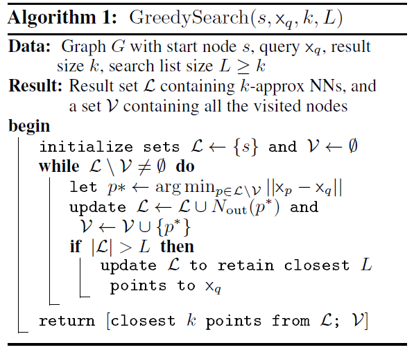
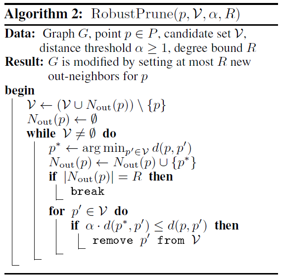
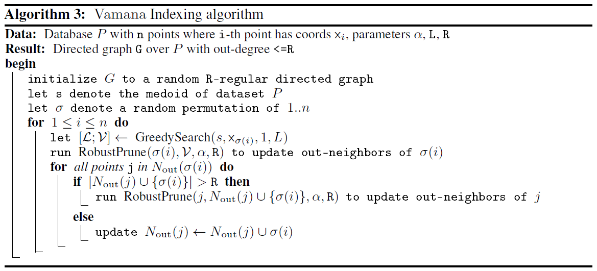

<center>
<h1>Ανάπτυξη Λογισμικού για Πληροφοριακά Συστήματα</h1>
</center>

##  Project: Προσσεγιστική Επίλυση του προβλήματος K-Εγγύτερων Γειτόνων (K-Nearest Neigbours) μέσω του Αλγορίθμου **Vamana Indexing Algorithm (VIA)**
### Τμήμα Πληροφορικής και Τηλεπικοινωνιών - ΕΚΠΑ - Χειμερινό Εξάμηνο 2024-2025

<div align="center">
  
| Ονοματεπώνυμο    | Αριθμός Μητρώου  |        email         |
| :-------------:  | :-------------:  |   :-------------:    |
| Ζήκας Αντώνιος   | 1115202100038    | sdi2100038@di.uoa.gr |
| Χασιώτη Ευανθία  | 1115202100289    | sdi2100289@di.uoa.gr |
| Κώτσιλας Σταύρος | 1115201700292    | sdi1700292@di.uoa.gr |

</div>

## Overview

### Χαρακτηριστικά Κώδικα
- <ins>Γλώσσα Υλοποίησης:</ins> C++11
- <ins>Μεταγλώττιση:</ins> **g++** (έγινε modularization των αρχείων σε directories και χρήση του [make](https://www.gnu.org/software/make/manual/make.html))
- <ins>Επαλήθευση Ορθότητας Κώδικα:</ins> **Unit Tests** με την χρήση της βιβλιοθήκης [Acutest](https://github.com/mity/acutest) (η εκτέλεση των test γίνεται μέσω ένος makefile rule)
- <ins>Mέσω της χρήσης [Github Actions](https://github.com/features/actions)</ins> εξασφαλίσαμε σε κάθε στάδιο ανάπτυξης του δεύτερου μέρους του Project την ορθή λειτουργία του κώδικα που γινόταν pushed στο main branch.

### Μεταγλώττιση και Εκτέλεση
- **Μεταγλώττιση του Κώδικα:** 
  
  Για την κατασκευή των εκτελέσιμων αρχείων παρέχονται διάφορες εντολές που εξασφαλίζουν τη μεταγλώττιση της κύριας εφαρμογής, των unit tests, καθώς και συνδιασμό τους:
  - Για την μεταγλώττιση της κύριας εφαρμογής:
    ```bash
    make app
    ```
  - Για την μεταγλώττιση των unit tests:
    ```bash
    make tests
    ```
  - Για την μεταγλώττιση και των δύο:
    ```bash
    make all
    ```
- **Εκτέλεση των Unit Test:**

  Για την εκτέλεση των **unit tests** παρέχονται δύο **makefile rulew** με τα οποία εκτελούνται όλα τα unit tests, απλά, είτε με τη χρήση του [valgrind](https://en.wikipedia.org/wiki/Valgrind) για έλεγχο της κατάστασης της μνήμης. Οι αντίστοιχες εντολές είναι:
  - Απλή Εκτέλεση:
    ```bash
    make run_tests
    ```
  - Εκτέλεση με Valgrind:
    ```bash
    make run_tests_valgrind
    ```
- **Εκτέλεση Εφαρμογής**:

  Η εφαρμογή στηρίζεται πάνω σε **ένα εκτελέσιμο αρχείο** το οποίο αφού μεταγλωττίσετε τον κώδικα μπορείτε να το βρείτε στο `/bin/main`. Αυτό το εκτελέσιμο αρχείο είναι υπεύθυνο για την εκτέλεση όλων των αλγορίθμων, χρησιμοποιώντας κατάλληλα **command line arguments** τα οποία περιγράφονται παρακάτω. Μερικά ενδεικτικά παραδείγματα όλων των λειτουργιών που προφέρει η εφαρμογή έχουν συμπιεστεί σε κατάλληλα makefile rules τα οποία είναι:
  - **Δημιουργία Simple Vamana:**
    ```bash
    make create_simple_via
    ``` 
  - **Δημιουργία Filtered Vamana:**
    ```bash
    make create_filtered_via
    ``` 
  - **Δημιουργία Stiched Vamana:**
    ```bash
    make create_stiched_via
    ``` 
  καθώς επίσης και δοκιμές πάνω σε **αποθηκευμένα indexes:**
  - **Δοκιμή Simple Vamana:**
    ```bash
    make test_simple_via
    ``` 
  - **Δοκιμή Filtered Vamana:**
    ```bash
    make test_filtered_via
    ``` 
  - **Δοκιμή Stiched Vamana:**
    ```bash
    make test_stiched_via
    ```

> [!IMPORTANT]
> Για το δεύτερο μέρος της εργασίας χρειάστηκε να υλοποιήσουμε εμείς έναν αλγόριθμο ο οποίος υπολογίζει το **Groundtruth** των δεδομένων. Γι αυτό το λόγο παρέχεται και ένα επιπλέον makefile rule το οποίο φαίνεται παρακάτω και η δουλειά του είναι ακριβώς να υπολογίζει το Groundtruth για τα **Filtered** και **Stiched** indexes.
> ```bash
> make compute groundtruth
> ```

- **Καθαρισμός αρχείων**:

Για τον καθαρισμό των αντικειμενικων **(object files)** και των εκτελέσιμων αρχείων **(executable files)** χρησιμοποιείται η εντολή:
```bash
make clean
```

### Datasets

*VIA = Vamana Indexing Algorithm*

Τα [δεδομένα](http://corpus-texmex.irisa.fr/) που χρησιμοποιούνται για τον Αλγόριθμο **Vamana Indexing**. Είναι σετ διανυσμάτων 128 διαστάσεων (με αριθμούς κινητής υποδιαστολής (float)). Στον κώδικά μας αξιοποιήσαμε το σετ δεδομένων `ANN_SIFT10K`. το οποίο περιέχει:
- `shiftsmall_base.fvecs`: 10.000 base vectors διάστασης 128. Κάθε vector θα αντιστοιχεί σε ένα κόμβο του γράφου **Vamana**, και περιέχει 128 floats.
- `shiftsmall_query.fvecs`: 100 query vectors διάστασης 128. Οι "search" vectors μας. O VIA θα υπολογίσει τους πλησιέστερους γείτονες αυτών των vector.
- `shiftsmall_groundtruth.ivecs`: Αυτό το αρχείο, για κάθε query vector, περιέχει 100 ακεραιες τιμές που αντιπροσωπεύουν τους identifiers (start 0) των base vectors που είναι οι εγγύτεροι γείτονες τους.
- `shiftsmall_learn.fvecs`: 25,000 learn vectors διάστασης 128. Σε αντίθεση με τα query vectors, τα learn vectors χρησιμοποιούνται αποκλειστικά για το optimization phase της ανάπτυξης του project στην παραμετροποιήση και βελτιστοποίηση των συναρτήσεων `RobustPrune()` και `GreedySearch()`.


### Περιγραφή Πρώτου Μέρους Project και Ζητούμενα
Στο πρώτο μέρος του Project κληθήκαμε να υλοποιήσουμε τον Αλγόριθμο **Vamana Indexing**, o oποίος λειτουργεί ως μία Προσεγγιστική Λυση του Προβλήματος της Εύρεσης των Κ-Εγγύτερων Γειτόνων, μέσω της χρήσης κατευθυνόμενου γράφου για την αναπαράσταση και επεξεργασία των δεδομένων. Η υλοποίησή μας στηρίχθηκε πάνω στο αρθρο του 2019, [DiskANN:Fast Accurate Billion-point Nearest Neighbour Search on a Single Node Search](https://proceedings.neurips.cc/paper_files/paper/2019/file/09853c7fb1d3f8ee67a61b6bf4a7f8e6-Paper.pdf). Πιο συγκεκριμένα, μας ζητήθηκε να υλοποιήσουμε τα εξής:

- `VamanaIndex()`
  - `GreedySearch()`
  - `RobustPrune()`

Για την εξέταση της λειτουργικότητας του **VIA** ήταν αναγκάιο να δημιουργήσουμε συμπληρωματικές κλάσεις και μεθόδους για:
- Ανάγνωση και αποθήκευση των [δεδομένων](http://corpus-texmex.irisa.fr/) (με συμπληρωματικές μεθόδους για ανάκτηση δεδομένων).
- Την δημιουργία κόμβων και την δημιουργία γράφου (και τις συμπληρωματικές τους μεθόδους).
- Υπολογισμός ευκλείδιας απόστασης και απόστασης Manhattan μεταξύ διανυσμάτων n-διαστάσεων.

# Διαδικασία Ανάπτυξης, Συνεργασία και Αρμοδιότητες Συμμετεχόντων της Ομάδας
Στην Ανάπτυξη του Project αξιοποιήθηκε το εργαλείο Issues του github για την επικοινωνία και τον συγχρονισμό των διεργασιών που είχε αναλάβει να διεκπεραιώσει το κάθε μέλος της ομάδας.

Καθόλη την διάρκεια της ανάπτυξης του Project υπήρξε συνεχείς επικοινωνία των μελών τόσο μέσω των εργαλείων του github όσο και με προγραμματισμένα online calls.

- Ζήκας Αντώνιος (1115202100038)
  - Υλοποίηση της βασικής κλάσης VectorData και των μεθόδων της, για την αποθήκευση των δεδομένων των διανυσμάτων που διαβάζουμε από τα αρχεία `.fvecs`.
  - Υλοποίηση των κλάσεων και των μεθόδων graph_node και graph. Δομές πάνω στις οποίες στηρίζεται ο αλγόριθμος για την δημιουργία του Vamana Index.
  - Υλοποίηση και βελτιστοποίηση της συναρτήσης `CreateVamanaIndex()`.
  - Συμβολή στηναποσφαλμάτωση και βελτιστοποίηση του αλγορίθμου `GreedySearch()`.
  - Υλοποίηση συνάρτησης `ReadGroundtruth()`, για την ανάγνωση των ακέραιων δεδομένων του αρχείου `shiftsmall_groundtruth.ivecs`.
  - Υλοποίηση συνάρτησης `CalculateRecallEvaluation()`, για την εξέταση της εγγυρότητας των αποτέλεσμάτων του ANN Vamana Index, βάσει των τιμών του `shiftsmall_groundtruth.ivecs`.
  - Υλοποίηση των Unit Test για τις μεθόδους του grah και graph_node.
  - Ολική συμβολή στην βελτιστοποίηση και αποσφαλμάτωση κώδικά για την ομαλή εκτέλεση των επιμέρους συνασρτήσεων.
- Χασιώτη Ευανθία (1115202100289)
  - Υλοποίηση της βασικής δομής του αλγορίθμου `GreedySearch()`.
  - Υλοποίηση (και συμβολή στην βελτιστοποιήση) της συνάρτησης `RobustPrune()`.
  - Υλοποίση της συνάρτησης `FindMediod()`, για την εύρεση του μέσου κόμβου του γράφου.
  - Συμβολή στην ασποσφαλμάτωση και βελτιστοποίηση της συνάρτησης `CreateVamanaIndex()`.
  - Ολική συμβολή στην βελτιστοποίηση και αποσφαλμάτωση κώδικά για την ομαλή εκτέλεση των επιμέρους συναρτήσεων.
- Κώτσιλας Σταύρος (1115201700292)
  - Υλοποίηση των συναρτήσεων `ReadVectorFile()` και `SaveVector()`, για την ανάγνωση και αποθήκευση των δεδομένων των διανυσμάτων των αρχείων `.fvecs`.
  - Υλοποίηση των Unit Tests για τις συναρτήσεις `ReadVectorFile()` και `SaveVector()`.
  - Συμβολή στον εμπλουτισμό και βελτιστοποίηση της κλάσης VectorData, για την ορθότερη αποθήκευση και επεξεργασία των δεδομένων.
  - Συμβολή στην ασποσφαλμάτωση και βελτιστοποίηση της συνάρτησης `CreateVamanaIndex()`.
  - Documentation του project / συγγραφή του αρχείου `README.md`.
  - Ολική συμβολή στην βελτιστοποίηση και αποσφαλμάτωση κώδικά για την ομαλή εκτέλεση των επιμέρους συνασρτήσεων.

# Υποστηρικτικές / Συμπληρωματικές Συναρτήσεις και Κλάσεις 
Η υλοποίηση των συναρτήσεων `VamanaIndex()`, `GreedySearch()`, `RobustPrune()` και `Recall()`, έγινε σύμφωνα με τους ψευδοκώδικες που παρουσιάζονται στο άρθρο, και φάινονται παρακάτω:

<div align="center">
  
   
  
  
</div>

Οι βασικότερες κλάσεις και μέθοδοι που υλοποιήθηκαν συμπληρωματικά αυτών που ζητήθηκαν στην εκφώνηση είναι:
1. Συνάρτηση `FindMedoid()`, για την εύρεση του ενδιάμεσου στοιχείου του συνόλου G, που παράγεται μέσα στην Vamana.
2. Συνάρτηση `CalculateRecallEvaluation()` , για την εξέταση της εγγυρότητας των αποτέλεσμάτων του ANN Vamana Index, βάσει των τιμών του `shiftsmall_groundtruth.ivecs`.
4. Κλάση `DataVector`, για την αποθήκευση των δεδομένων των αρχείων `.fvecs`.
5. Κλάσεις `Graph` και `GraphNode`. Δομές τι οποίες αξιοποιεί ο **VIA**.
6. Συναρτήσεις `ReadVectorFile()` και `SaveVector()`, για την ανάγνωση και αποθήκευση των δεδομένων.
7. Συναρτήσεις `EuclidianDistance()` και `ManhattanDistance()`, για τον υπολογισμό της απόστασης μεταξύ των διανυσμάτων.

# Flowchart Αλγορίθμου

Για την εκτέλεση του κώδικα πληκτρολογούμε τις εντολές:
- `make all`
- `time ./bin/main 'data/siftsmall/siftsmall_base.fvecs' 'data/siftsmall/siftsmall_query.fvecs' 'data/siftsmall/siftsmall_groundtruth.ivecs' 100 1.0 120 14 0`

Οι τιμές στο τέλος αντιστοιχούν στις παραμέτρους:
- K, ο αριθμός των εγγύτερων γειτόνων που θέλουμε να βρούμε.
- α, πολαπλασιαστικός παράγωντας μείωσης απόστσης προς το query vector.
- L, η λίστα με τους πλησιέστερους κόμβους / γέιτονες του query vector, αξιοποιείται απο την `GreedySearch()`
- R, ο μέγιστος αριθμός εξερχόμενων ακμών που θα έχει ο κάθε κόμβος.
- query_number, το Index του query vector για το οποίο θέλουμε να βρούμε τους εγγύτερους γείτονες (για τα data στο shiftsmall το εύρος είναι 0-99).

Η εκτέλεση του **Vamana Indexing Algorithm** γίνεται σε τρεις φάσεις:

### Initialization Phase
Στο Initialization phase, γίνεται η ανάγνωση και η αποθήκευση των δεδομένων μας από τις συναρτήσεις:

- `ReadVectorFile()`
- `ReadgroundΤruth()`
  
Η οποίες διαβάζουν από τα αρχεία `siftsmall_base.fvecs`, `siftsmall_query.fvecs` και `siftsmall_groundtruth.ivecs` τα δεδομένα μας.

### Vamana Phase
Σε δεύτερη φάση, ξεκινά η  δημιουργία του τυχάιου γράφου από την `Vamana()`, η οποία αναθέτει τα δεδομένα του `siftsmall_base.fvecs` σε αντικείμενα της κλάσης `node`, και ύστερα δημιουργεί τυχαίες εξερχόμενες ακμές από καθένα από αυτούς (με όριο τον αριθμό R που ορίζουμε από την γραμμή εντολών). Ο γράφος αναπαριστάται με λίστα γειτνίασης.

Ακολουθούν οι διαδικασίες `GreedySearch()` και σε συνδυασμό με την `RobustPrune()`, εκτελούν την βασική λειτουργία του **Vamana Indexing Algorithm**  όπου είναι η αναζήτηση των K εγγύτερων γειτόνων του query vector (που το ορίζουμε από την γραμμή εντολών), με την βοήθεια της διαδικασίας του κλαδέματος ακμών. 

### Validity Phase

Στην τελευταία φάση του αλγορίθμου, καλείται η `GreedySearch()` για τον υπολογισμό των K εγγύτερων γειτόνων, και ακολουθεί η μέθοδος `CalculateRecallEvaluation()`, η οποία εξετάζει την εγκυρότητα των αποτελεσμάτων που επιστράφηκαν από την δεύτερη φάση, με τις τιμές που βρίσκονται στο αρχείο `siftsmall_groundtruth.ivecs` και επιστρέφει το ποσοστό "ομοιότητας" των πρσεγγιστικών τιμών του **VIA** με την πραγματική τιμή του K.

